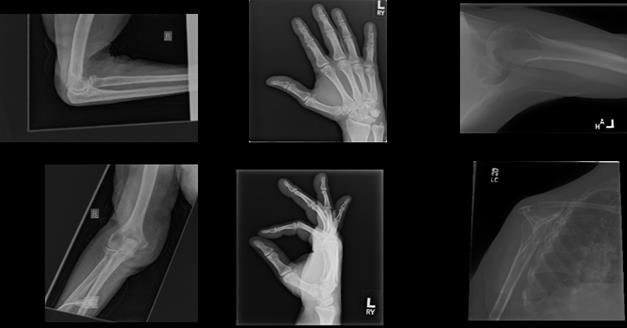

# x-ray-abnormality-detection

[](https://nbviewer.jupyter.org/github/ilias-ant/x-ray-abnormality-detection/tree/main) [](https://www.tensorflow.org/) [](https://github.com/psf/black) 

An attempt at the Bone X-Ray Deep Learning Competition (Stanford ML Group).

From the paper (see Citation below):

> The MURA abnormality detection task is a binary classification task, where the input is an upper exremity radiograph study — with each study containing one or more views (images) — and the expected output is a binary label y ∈ {0, 1} indicating whether the study is normal or abnormal,
respectively.



## Installation

To enable reproducibility, [Poetry](https://python-poetry.org/) has been used as a dependency manager.

```shell
python3 -m pip install poetry
```

and then:

```shell
python3 -m poetry install
```

To serve the Jupyter notebooks, run:

```shell
python3 -m poetry run jupyter notebook
```

## Contributors

- [Ilias Antonopoulos](https://github.com/ilias-ant)
- [Silva Ndoja](https://github.com/sndoja)

## Citation

```bibtex
@article{Rajpurkar2017MURALD,
  title={MURA: Large Dataset for Abnormality Detection in Musculoskeletal Radiographs.},
  author={Pranav Rajpurkar and Jeremy A. Irvin and Aarti Bagul and Daisy Yi Ding and Tony Duan and Hershel Mehta and Brandon Yang and Kaylie Zhu and Dillon Laird and Robyn L. Ball and C. Langlotz and Katie S. Shpanskaya and Matthew P. Lungren and A. Ng},
  journal={arXiv: Medical Physics},
  year={2017}
}
```
